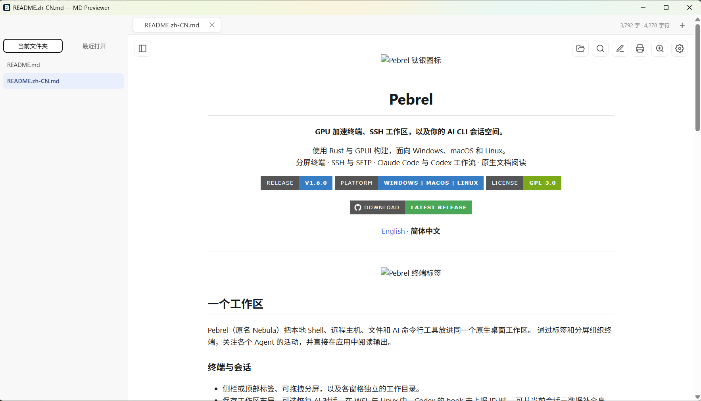
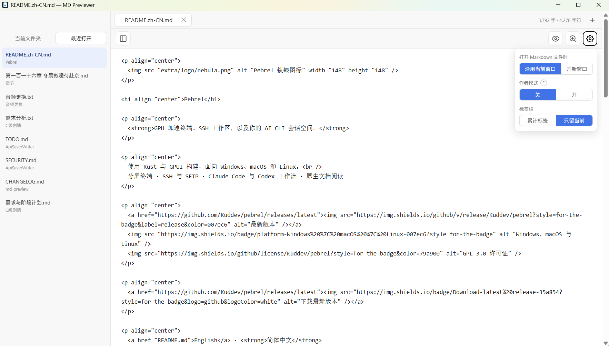

# MD Previewer

**[English](README.md) · 简体中文**

[](https://github.com/ArnoldRedman/md-preview/actions/workflows/ci.yml)
[](LICENSE)

MD Previewer 是一个体积小、本地优先的 Markdown 阅读器和快速编辑器，桌面端使用 Rust 与系统 WebView，不内置 Chromium，也不依赖 Electron。


## 效果展示

### 预览模式


### 编辑模式与设置面板


## 当前功能

- 从命令行、文件选择器、拖放或系统文件关联打开 Markdown 与 `.txt` 文本文件
- 针对 `.txt` 文件的专属纯文本排版适配：完整保留换行与缩进，安全字符转义，不发生 Markdown 语法冲突
- 多文档标签与会话恢复；在 Windows 资源管理器中再次打开文件会复用现有窗口
- 工具栏齿轮可设置：打开 Markdown 时复用当前窗口还是开新窗口，标签栏累计标签还是只留当前
- 可折叠的左侧栏，列出当前文档所在文件夹和最近打开的文件，在章节之间切换不必再走文件选择器
- 作者模式：在章节标题旁和正文上方加复制按钮，分别复制整行标题、去掉「第 N 章」序号的标题，以及全部正文
- 外部编辑器写盘后自动刷新
- 表格、任务列表、代码高亮、GitHub Alerts、KaTeX、Mermaid、本地图片和本地文档链接
- 预览搜索、正文缩放、打印、源码编辑和可靠自动保存
- iOS 与 Android 原生只读预览外壳

渲染资源全部离线内置。**自动更新当前已禁用**，等本 fork 建立独立且可信的签名发布通道后再启用。

目前发布的安装包**仅有 Windows**。macOS 与移动端外壳可以从源码构建，但因为本 fork 还没有签名身份，暂不发包。

## Windows 一键构建

在 Windows 上直接双击仓库根目录的：

```text
build-windows.cmd
```

脚本会依次运行 Rust 测试、Release 构建、安装包生成，以及隔离目录中的安装/卸载自测。产物位于 `dist`：

```text
dist\MD-Previewer-windows-x64.exe   单文件便携版
dist\MD-Previewer-Setup.exe         当前用户安装包
dist\SHA256SUMS.txt                 SHA-256 校验值
```

安装包不需要管理员权限，默认安装到 `%LOCALAPPDATA%\Programs\MD Previewer`，并创建开始菜单入口、卸载入口和 Markdown“打开方式”。它依赖系统 WebView2，不会把 WebView2 打进安装包。命令行或 CI 可用 `build-windows.cmd --no-pause` 跳过结束暂停。

## 构建

```bash
cargo test
cargo build --release
./target/release/md-previewer README.md
```

Windows 产物：`target/release/md-previewer.exe`。

macOS 通用应用：

```bash
./bundle.sh
./install.sh
```

移动端：

```bash
cd mobile/ios && xcodegen generate
cd mobile/android && gradle :app:assembleDebug
```

仓库统一验证入口：

```bash
./scripts/verify.sh
```

## 隐私与安全

MD Previewer 没有账号、遥测、分析统计或后台更新请求。网页链接只在用户主动点击后交给系统打开；Markdown、图表、公式和代码高亮都在本机渲染。文档仍可能引用远程图片或其他网络资源，系统 WebView 在渲染时可能请求这些资源。

当前 fork 基线仍允许 Markdown 原始 HTML。在 HTML 清理功能完成前，请只打开可信文档。

## Fork 身份

- 产品名：**MD Previewer**
- 可执行文件/包名：`md-previewer`
- 桌面 App ID：`io.github.arnoldredman.mdpreviewer`
- 移动端 App ID：`io.github.arnoldredman.mdpreviewer.mobile`
- 配置目录：`md-previewer`

本项目派生自 [`vorojar/md-preview`](https://github.com/vorojar/md-preview)。归属信息见 [NOTICE](NOTICE) 与 [LICENSE](LICENSE)。

## 许可证

MIT。上游项目与当前 fork 的版权声明均保留在 [LICENSE](LICENSE) 中。
