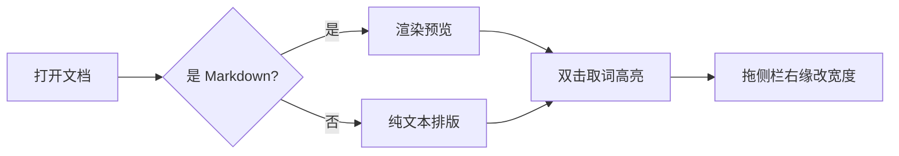

# 手动验收清单

这是**用应用打开**的样例文档，不是给 GitHub 直接读的说明：用 MD Previewer 打开本文件，
按每节写的操作做一遍，对照"期望"看结果。它同时承担两个角色：

- 手动验收：自动化断言（`scripts/verify-*.mjs`）盖不到的观感、手感、跨主题表现
- 渲染压力样例：重复词、行内/块级公式、Mermaid、8 列宽表、多级标题都在里面

改动交互或渲染后，请同步更新本文件对应小节（两边都要动，和 `scripts/verify-*.mjs` 一样）。

---

## 一、取词：双击或者自己拖选

这一段里 `sidebarWidth` 出现四次，方便你数对不对：sidebarWidth 是设置里的键名，
写盘前会先夹进 180–560 的区间，所以 sidebarWidth 不会被写成一个把正文挤没的值。

自己被选中的那一段始终保持正常的灰色 / 蓝色选中底色，变绿的只是别处的出现。

- 双击 `sidebarWidth`：四处全变绿，自己被双击的那个保持原生选中色
- 自己拖拽选中"sidebar"这六个字：同一个词依然四处都标上
- 只选中词的一部分（比如 `sidebarW`）：不带空白就算一个词，照样会去标，只是多半标不到别处
- 选区带空格（比如拖完一整句）：不取词，正文保持干净
- 点空白处或按 Esc 立刻清掉所有绿底
- 选中后按 Ctrl+C：复制到的正好是那个词，不带多余空格

```rust
// 代码块里的 sidebarWidth 也会一起标绿（Notepad++ 在代码里也标）
pub(crate) const SIDEBAR_WIDTH: f64 = 260.0;
if settings.sidebar_width as f64 != SIDEBAR_WIDTH {
    resize_for_sidebar(&window, true, settings.sidebar_width as f64);
}
```

| 出现位置 | 期望行为 |
| --- | --- |
| 正文段落 | 全部标绿 |
| 行内代码 / 代码块 | 标绿 |
| 公式、Mermaid 图 | 不动（改了会破坏渲染） |
| 搜索命中的黄底 | 互不干扰，可以同时存在 |
| 自己划的那段 | 保持原生选中色 |

## 二、中文取词：取词

中文的双击范围由 WebView 的断词规则决定（一般两个字）。自己拖选四个字"取词高亮"也应该生效：
取词、双击取词、取词高亮、清取词标记。

单个词只出现一次时（比如 Supercalifragilisticexpialidocious），应该只有它自己变绿。

## 三、选中底色

下面这段是给你拖拽划选用的：MD Previewer 是本地优先的 Markdown 阅读器，
用 Rust 加系统 WebView 写成，桌面端不打包 Chromium，手机端只做只读预览。
选中底色在浅色主题是淡蓝、深色主题是深蓝，都不该出现"有选中但没有底色"的情况。

## 四、公式（压缩内嵌的 KaTeX 必须照常渲染）

行内公式 $E = mc^2$ 和 $a^2 + b^2 = c^2$ 都要正常显示。

$$
\int_0^\infty e^{-x^2}\,\mathrm{d}x = \frac{\sqrt{\pi}}{2}
$$

## 五、图表（压缩内嵌的 Mermaid 必须照常渲染）



## 六、表格 / 警告框 / 任务列表

| 列一 | 列二 | 列三 | 列四 | 列五 | 列六 | 列七 | 列八 |
| --- | --- | --- | --- | --- | --- | --- | --- |
| 表格宽度必须自适应 | 放不下才自己横向滚 | 不能顶出窗口 | 侧栏展开时也要跟着变窄 | 拖宽侧栏后表格要重排 | 分栏模式下同样 | 手机上也是 | 最后一行占位 |

> [!WARNING]
> 表格跑出可视范围就是 bug：拖侧栏前后各看一眼右边是否有横向滚动条。

- [x] 侧栏右缘能拖
- [ ] 拖动时指针是左右箭头、不会一路选中侧栏文字
- [ ] 松手后关掉应用再开，宽度还在

==这段是 Markdown 高亮语法==，双击"高亮"两个字时，它自己所在的黄底不应该被破坏。

## 七、侧栏

### 7.1 拖动

拖到 180px 附近应该停住，拖到 560px 附近也应该停住；越界会夹回区间，
正文左边距要跟侧栏同步让出空间，不能出现正文被侧栏压住的情况。

压到最窄时，上方"当前文件夹 / 最近打开 / 大纲"三个标签可以折成两行，
但必须完全待在自己的按钮里（按钮跟着变高），不能溢出框外。

### 7.2 键盘

按 `Ctrl+B` 开合侧栏。展开后焦点会直接落在右缘的拖拽条上（能看到蓝色描边），
接着按 `←` / `→` 调宽度（16px），`Shift+←` / `Shift+→` 调 64px，每按一次都会写进设置。

在编辑框里打字时按 `Ctrl+B`：侧栏照常开合，但焦点不该被抢走，光标要留在原处。

### 7.3 开合

点左上角侧栏按钮收起再展开：窗口应该往右缩一条侧栏的宽度、再补回来，
正文可视宽度不要跟着跳。宽度设成 400 时，收放一圈后正文位置应该和以前一致。

### 7.4 分区与滚动

目录 / 最近 / 大纲三个分区都点一遍，最近列表里的条目悬浮要能看到完整路径。
侧栏条目多到需要滚动时，拖拽条不能跟着滚走，要始终贴着侧栏右缘全高。

### 7.5 编辑模式

按 `Ctrl+E` 进编辑模式，双击取词高亮只在预览区生效，编辑框走原生选中；
再按 `Ctrl+E` 回预览，标记应该已经被清掉。

## 八、回归检查

- 预览搜索（`Ctrl+F`）：搜 `sidebarWidth`，黄底命中要和绿底取词标记互不打架；
  在几千处命中的大文档里搜常见词，计数会显示成 `1/2000+`，界面不该卡住
- 打印预览（`Ctrl+P`）：侧栏、拖拽条都不应该被打出来
- 深浅主题（设置面板切换）：选中底色、取词绿底都要跟着换色，不能有一项在深色下看不清
